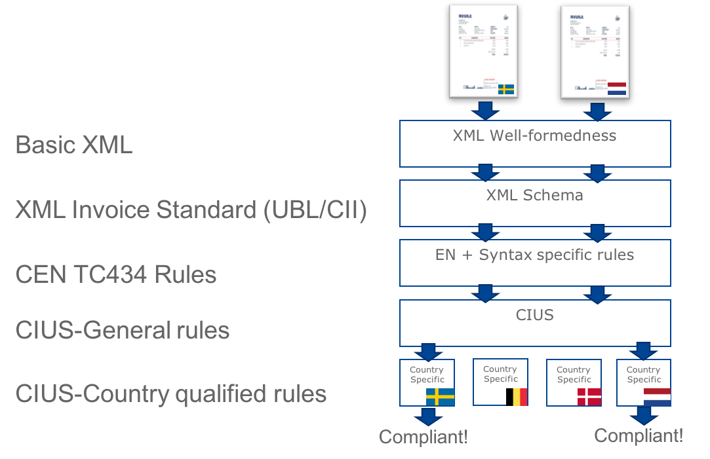

= Introduction

== Country specific validation rules

The PEPPOL BIS Billing v3 allows for validation rules which are triggered based on the country code of the supplier, and which is not in conflict with any other rules for the profile or transaction.

[IMPORTANT]
====
By *"country code of the supplier"* is meant (in prioritised order)

. the country code prefixing the Seller VAT identifier (BT-31)
. The country code prefixing the Sellers Tax Representative VAT identifier (BT-63)
. The seller country code (BT-40)
====

Country-qualified rule sets can be added to the PEPPOL BIS on request from the PEPPOL Authority of the specific country.
The PEPPOL Authority is responsible for the development, testing and maintenance of the rules. The country specific rules makes it possible to use the PEPPOL BIS without the need of creating a country specific CIUS.
The same specification and validation rules can be used by all PEPPOL users and no need to specifically identify the customization neither in the XML message or in the SMP-registration.

The below diagram shows a simplified view of the validation steps. An invoice issued by a Swedish supplier goes through all validation steps but only invokes the country specific rule sets which is intended for Swedish suppliers.

